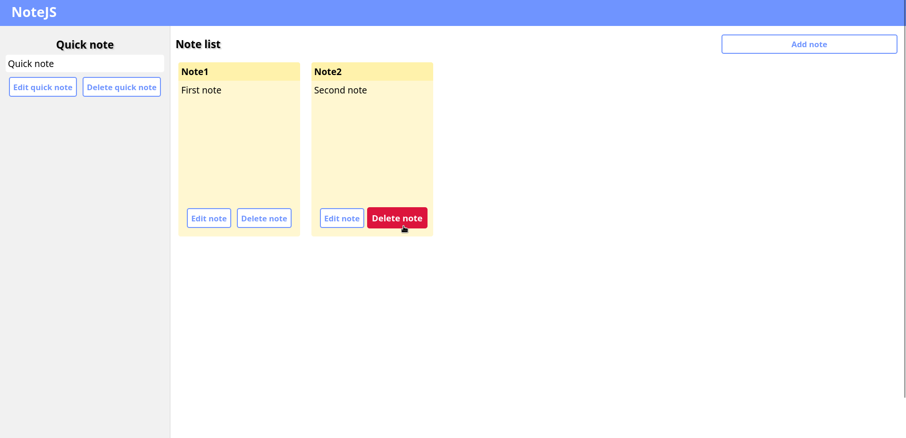
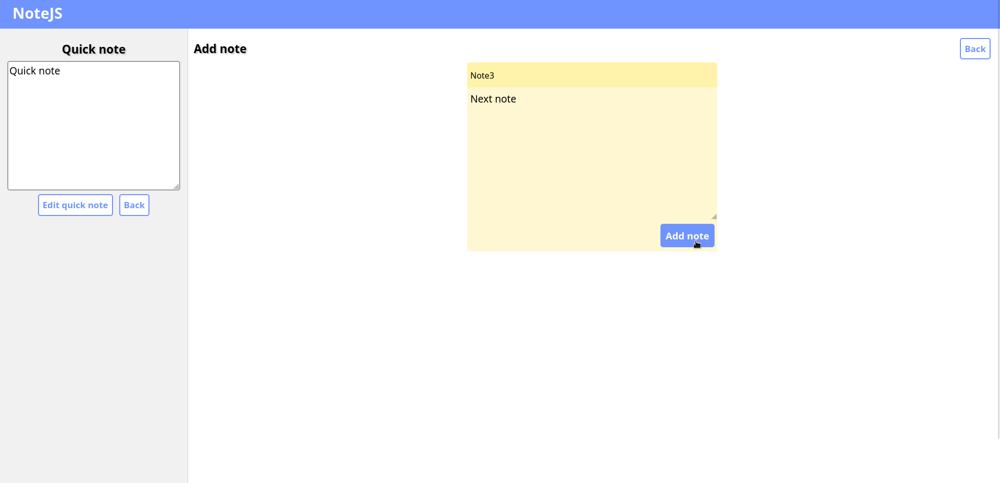
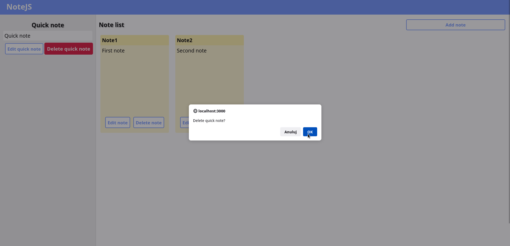

## Note App

The application allows you to create, edit and delete notes that are stored in a MongoDB database. In addition, it is possible to create, edit, delete one quick note that is stored in the Redis database. The frontend was made in JavaScript/React and the backend was made in Go. The project was made for a Golang course at the University of Gdańsk.

## Project Status

Project completed on 19 June 2022

## Screenshots

## Technologies Used

#### JavaScript

-   axios
-   formik
-   prettier
-   react
-   react-dom
-   react-router-dom
-   react-scripts
-   sass
-   yup

#### Go

-   go-redis
-   gorilla/mux
-   cors
-   mgo.v2/bson
-   net/http
-   toml

## Installation and Setup Instructions

Before starting the project, you must start MongoDB and Redis databases. You can run it using Docker. You need to install Docker, then use the command to start MongoDB and Redis containers.

`docker run -dp 27017:27017 --name mongodb mongo`

`docker run -dp 6379:6379 --name redis redis`

Clone down this repository. You will need go, node and npm/yarn installed globally on your machine.

#### Backend

Installation:

`go get ./`

To Start App:

`go run main.go`

#### Frontend

Installation:

`npm install` or `yarn install`

To Start App:

`npm start` or `yarn start`

To Visit App:

`https://localhost:3000/`
